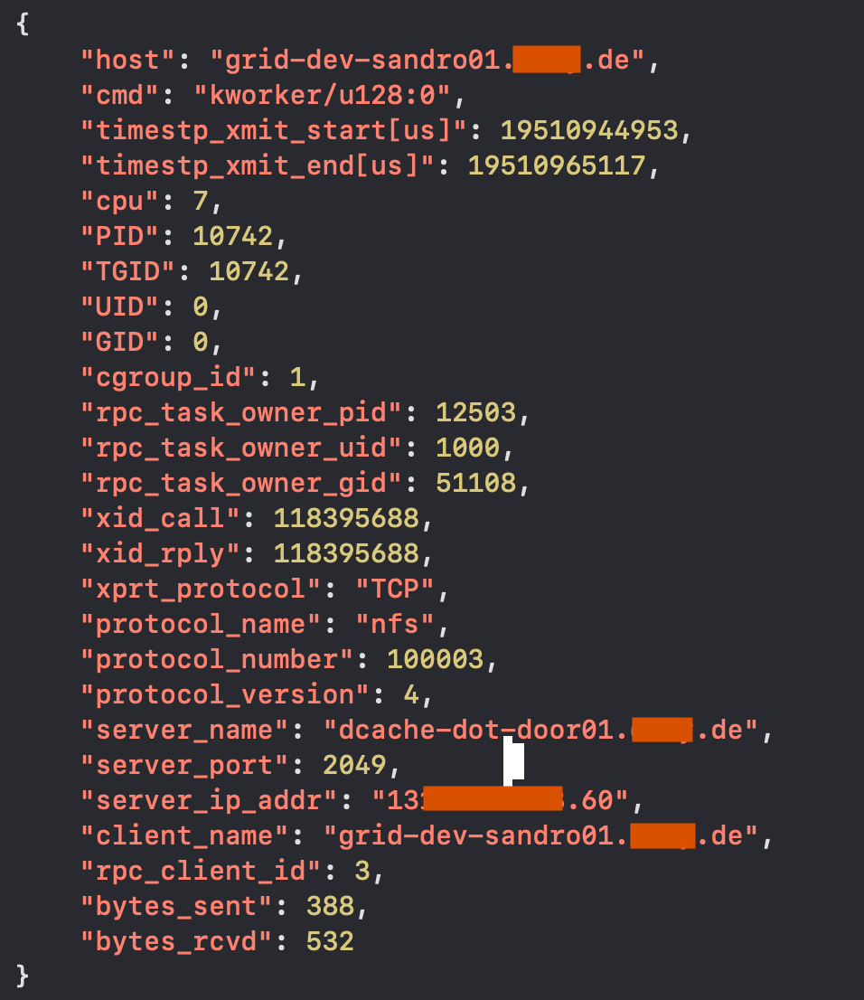
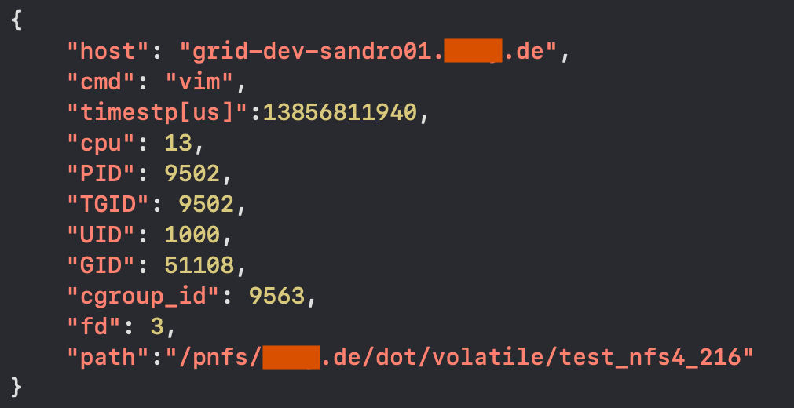
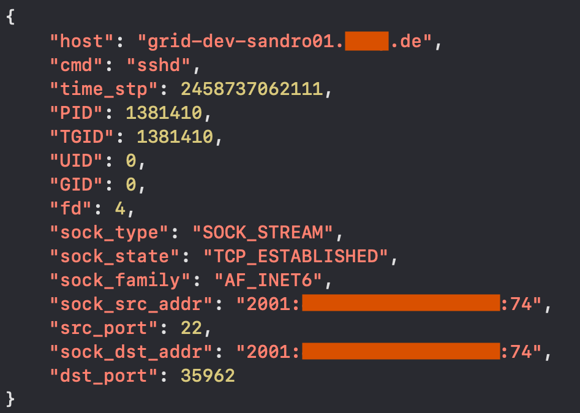
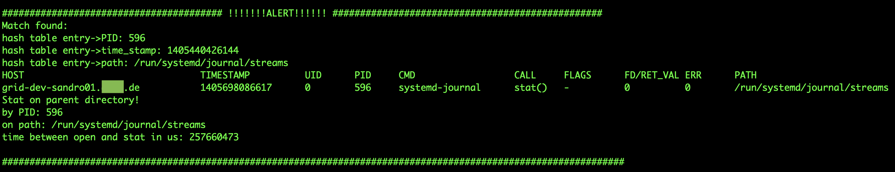

## Welcome!
**This repository contains custom made bpf programs, that were developed according to specific needs of system administrators. <br>
So far, two of the programs collect NFSv4+ (Network Filesystem version 4+) related kernel metrics. <br>
Another one gathers metrics associated with sockets and yet another has a rather peculiar purpose. <br>
See descriptions below for details.**<br>

These bpf programs can be used, shared, extended or otherwise modified according to your specific needs.<br>
The bpf programs were tested with Linux kernel version 5.14.0-503.26.1.el9_5.x86_64. <br>
Help with improving and extending this collection is very much appreciated. <br>


## Here is what the bpf programs do:
1. [nfs4_byte_picker](#1-nfs4_byte_picker)
2. [nfs4_path_finder](#2-nfs4_path_finder)
3. [socket_collector](#3-socket_collector)
4. [open_stat_interceptor](#4-open_stat_interceptor)


## 1. nfs4_byte_picker

The ```nfs4_byte_picker``` program collects the bytes sent and received via NFSv4 in each RPC round-trip. As the sample output below shows, the "rpc_task_owner_pid" and corresponding "rpc_task_owner_uid" fields contain the PID and UID of the userland process, if applicable, that triggered the NFSv4 request across the Linux NFS client.  




## 2. nfs4_path_finder

The ```nfs4_path_finder``` program assembles NFSv4 paths opened by userland processes, whenever these are scheduled and executed on a CPU.




## 3. socket_collector

The ```socket_collector``` program collects kernel metrics of sockets opened by userland processes.



## 4. open_stat_interceptor

The ```open_stat_interceptor``` outputs an alert, whenever a userland process calls a ```stat()``` on the parent directory of a file previously opened by the same process with an ```O_CREAT``` flag set.




For more information on the usage and options, see the help output of each program.

May this be helpful :) 